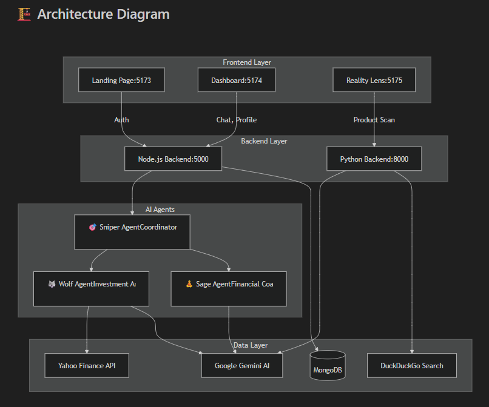

# FinSync AI - The Autonomous Financial Ecosystem

> "Existing apps just track your money. FinSync defends your money and grows it using a team of autonomous agents."

A revolutionary fintech platform powered by a multi-agent AI system that combines investment analysis, behavioral coaching, and augmented reality to transform how people make financial decisions.

## 🌟 Features

### 🤖 Multi-Agent AI System ("The 3-Brain Architecture")

1. **🐺 The Wolf (Investment Agent)**
   - Powered by Google Gemini + Yahoo Finance API
   - Real-time stock analysis and comparison
   - P/E ratios, analyst ratings, and market trends
   - Buy/Sell/Hold recommendations with detailed reports

2. **🧘 The Sage (Financial Coach)**
   - Behavioral finance expert with long-term memory
   - Tracks your financial goals and spending patterns
   - Provides empathetic nudges against impulsive purchases
   - Considers emotional impact of financial decisions

3. **🎯 The Sniper (Coordinator)**
   - Intelligent intent classification
   - Routes queries to appropriate specialist agents
   - Combines multiple agent perspectives when needed
   - Manages conversation context and flow

### 📱 Reality Lens (AR Finance)

The "WOW" feature - An augmented reality camera mode that reveals the true cost of purchases:

- Point your camera at any product
- AI Vision (Gemini Multimodal) identifies the item
- Real-time price fetching from online sources
- Converts price to **labor hours** based on your income
- Shows financial impact on your savings and goals
- AR overlay displays: "This costs 320 hours of your coding work"

### 💼 Comprehensive Dashboard

- Financial health overview
- Real-time agent chat interface
- Goal tracking and progress monitoring
- Future simulator for financial decisions
- User profile with detailed financial data

## 🏗️ Architecture

### Project Structure

```
WebDev/
├── backend/                    # Unified Node.js Backend
│   ├── agents/
│   │   ├── wolfAgent.js       # Investment analyst
│   │   ├── sageAgent.js       # Financial coach
│   │   └── sniperAgent.js     # Coordinator
│   ├── models/
│   │   └── User.js            # MongoDB user schema
│   ├── routes/
│   │   ├── auth.js            # Authentication
│   │   ├── user.js            # User management
│   │   └── chat.js            # Agent chat
│   ├── middleware/
│   │   └── auth.js            # JWT middleware
│   ├── config/
│   │   └── database.js        # MongoDB connection
│   └── server.js              # Express server
│
├── 1rupee-main/               # Landing Page (React + Vite)
│   └── src/
│       ├── components/        # Hero, Features, Navbar, etc.
│       └── utils/
│           └── api.js         # API client
│
├── finpal-main/               # Dashboard (React + Vite)
│   └── src/
│       ├── pages/
│       │   ├── Dashboard.jsx
│       │   ├── AgentChat.jsx  # Multi-agent chat
│       │   ├── RealityLens.jsx
│       │   ├── FutureSimulator.jsx
│       │   └── Profile.jsx
│       └── components/
│           ├── Sidebar.jsx
│           └── Topbar.jsx
│
└── finsync-reality-lens/      # AR Feature (React + Python)
    ├── src/
    │   ├── ARScene.jsx        # AR interface
    │   └── App.jsx
    └── Backend/
        └── main.py            # FastAPI + Gemini Vision
```




### Technology Stack

**Frontend:**
- React 18/19
- Vite
- React Router DOM

**Backend:**
- Node.js + Express (Main API)
- Python + FastAPI (Reality Lens)
- MongoDB + Mongoose
- JWT Authentication

**AI & APIs:**
- Google Gemini 2.5 Flash (Multi-agent system + Vision)
- Yahoo Finance API (Stock data)
- DuckDuckGo Search (Price fetching)

## 🚀 Getting Started

### Prerequisites

- Node.js 18+ and npm
- Python 3.8+
- MongoDB (local or cloud)
- Google Gemini API key

### Installation

1. **Clone the repository**
   ```bash
   cd WebDev
   ```

2. **Set up the Backend**
   ```bash
   cd backend
   npm install
   
   # Copy and configure environment variables
   copy .env.example .env
   # Edit .env and add your:
   # - MONGODB_URI
   # - JWT_SECRET
   # - GEMINI_API_KEY
   ```

3. **Set up the Landing Page**
   ```bash
   cd ../1rupee-main
   npm install
   ```

4. **Set up the Dashboard**
   ```bash
   cd ../finpal-main
   npm install
   ```

5. **Set up the Reality Lens**
   ```bash
   cd ../finsync-reality-lens
   npm install
   
   # Set up Python backend
   cd Backend
   pip install -r requirements.txt
   
   # Configure .env with GOOGLE_API_KEY
   ```

### Running the Application

You need to run all services concurrently:

**Terminal 1 - Node.js Backend:**
```bash
cd backend
npm start
# Runs on http://localhost:5000
```

**Terminal 2 - Landing Page:**
```bash
cd 1rupee-main
npm run dev
# Runs on http://localhost:5173
```

**Terminal 3 - Dashboard:**
```bash
cd finpal-main
npm run dev
# Runs on http://localhost:5174
```

**Terminal 4 - Reality Lens Frontend:**
```bash
cd finsync-reality-lens
npm run dev
# Runs on http://localhost:5175
```

**Terminal 5 - Reality Lens Backend:**
```bash
cd finsync-reality-lens/Backend
python main.py
# Runs on http://localhost:8000
```

### First Time Setup

1. Open http://localhost:5173 (Landing Page)
2. Click "Get Started" or "Login"
3. Create an account with your financial information:
   - Email and password
   - Monthly income
   - Monthly expenses
   - Current savings
4. You'll be redirected to the dashboard at http://localhost:5174

## 📖 Usage

### Chat with AI Agents

1. Navigate to "Agent Chat" in the dashboard
2. Ask questions like:
   - "Should I buy Tesla stock?" → Wolf Agent responds
   - "I want to buy a new iPhone" → Sage Agent responds
   - "Compare Apple vs Microsoft stock" → Both agents respond

### Use Reality Lens

1. Navigate to "Reality Lens" in the dashboard
2. Upload a product image or use your camera
3. The AI will:
   - Identify the product
   - Fetch real-time price
   - Calculate labor hours needed
   - Show financial impact on your goals

### Track Financial Goals

1. Go to your Profile
2. Add financial goals (e.g., "Buy a car", "Europe trip")
3. Set target amounts and deadlines
4. Agents will reference these goals in their advice

## 🔑 API Endpoints

### Authentication
- `POST /api/auth/signup` - Create new user
- `POST /api/auth/login` - Login user
- `GET /api/auth/me` - Get current user (protected)

### User Management
- `GET /api/user/profile` - Get user profile (protected)
- `PUT /api/user/profile` - Update profile (protected)
- `POST /api/user/goals` - Add financial goal (protected)
- `PUT /api/user/goals/:goalId` - Update goal (protected)
- `DELETE /api/user/goals/:goalId` - Delete goal (protected)

### Agent Chat
- `POST /api/chat` - Send message to agents (protected)
- `GET /api/chat/history` - Get conversation history (protected)
- `POST /api/chat/stock-analysis` - Analyze specific stock (protected)
- `POST /api/chat/spending-analysis` - Analyze spending decision (protected)

### Reality Lens
- `POST http://localhost:8000/scan` - Scan product image

## 🎨 Design Philosophy

- **Glassmorphism UI** with backdrop blur effects
- **Dark mode** with vibrant accent colors
- **Smooth animations** and micro-interactions
- **Responsive design** for all screen sizes
- **Premium aesthetics** that wow users

## 🔒 Security

- JWT-based authentication
- Password hashing with bcrypt
- Protected API routes
- CORS configuration for multiple frontends
- Environment variable management

## 🧪 Testing

### Manual Testing Checklist

- [ ] User signup with financial data
- [ ] User login and token persistence
- [ ] Agent chat with Wolf (investment questions)
- [ ] Agent chat with Sage (spending decisions)
- [ ] Stock comparison feature
- [ ] Reality Lens product scanning
- [ ] Goal creation and tracking
- [ ] Profile updates
- [ ] Logout and session clearing

## 🚧 Future Enhancements

- [ ] Real-time stock price updates (WebSocket)
- [ ] Mobile app (React Native)
- [ ] Social features (share goals, compare progress)
- [ ] Advanced analytics dashboard
- [ ] Integration with bank accounts (Plaid API)
- [ ] Voice interface for agents
- [ ] Automated savings recommendations

## 📝 Environment Variables


## 🤝 Contributing

This is a hackathon project showcasing innovative fintech solutions. Feel free to fork and build upon it!

## 📄 License

MIT License - feel free to use this project for learning and inspiration.

## 🎯 Hackathon Highlights

**Innovation:** First fintech app to combine multi-agent AI with AR for financial decisions

**Technical Complexity:** 
- 3 specialized AI agents with distinct personalities
- Hybrid backend (Node.js + Python)
- Real-time stock data integration
- Computer vision for product recognition
- Behavioral finance algorithms

**User Experience:**
- Stunning glassmorphism UI
- Seamless multi-agent conversations
- AR "Reality Lens" - the showstopper feature
- Personalized financial coaching

**Real-World Impact:**
- Helps users visualize true cost of purchases
- Prevents impulsive spending
- Democratizes investment analysis
- Makes financial planning engaging and interactive

---

## 🔒 Security Notice

> [!IMPORTANT]
> **API Keys Required**: This project requires a Google Gemini API key to function. The `.env` files in this repository contain placeholder values only. You **MUST** add your own API keys before running the application.

**Never commit your actual API keys to version control.** See [SECURITY.md](file:///c:/Users/FARAZ%20KHAN/Desktop/DEKSTOP/PROJECTS/WebDev/SECURITY.md) for detailed security guidelines.

---

**Built with ❤️ for the future of personal finance**
```
